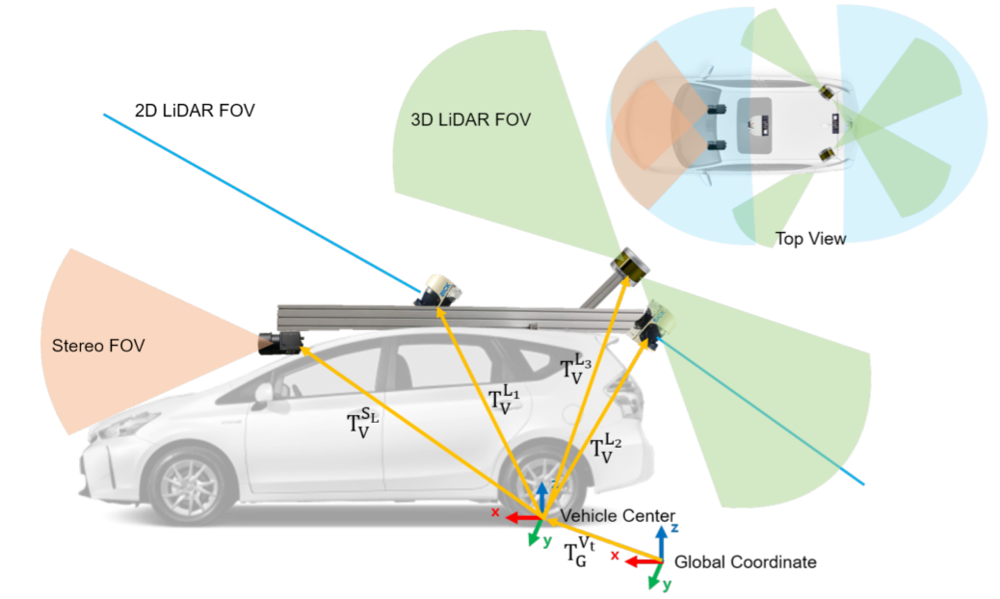
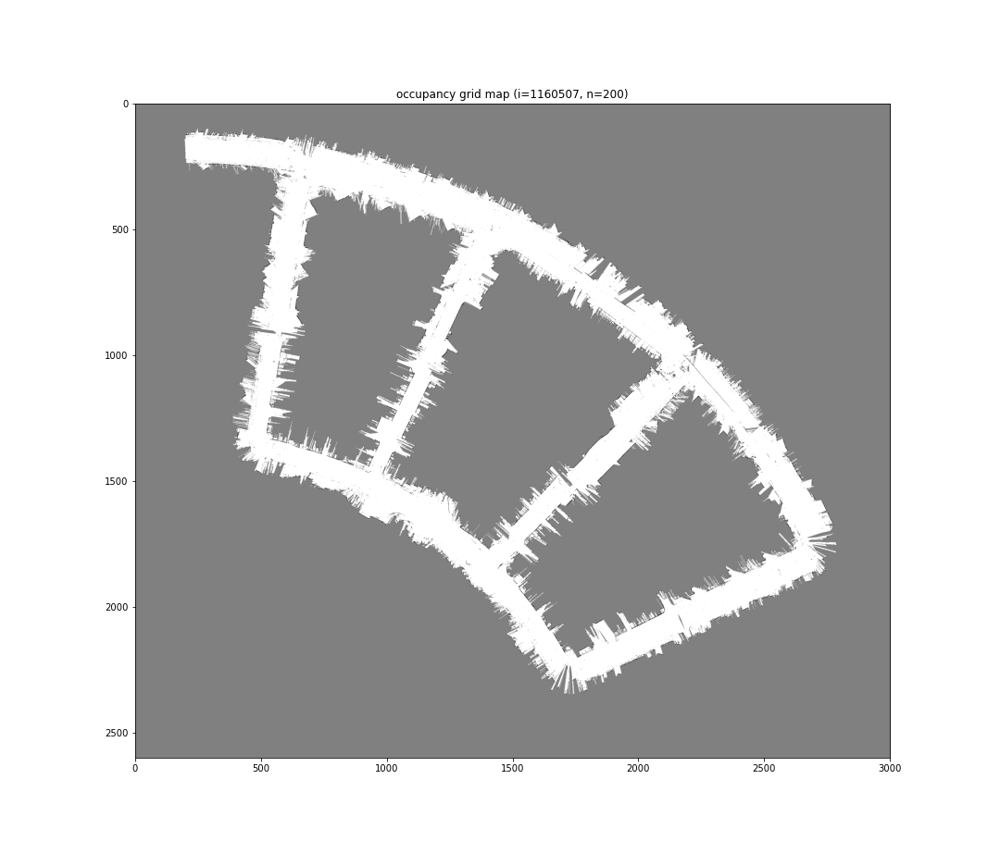
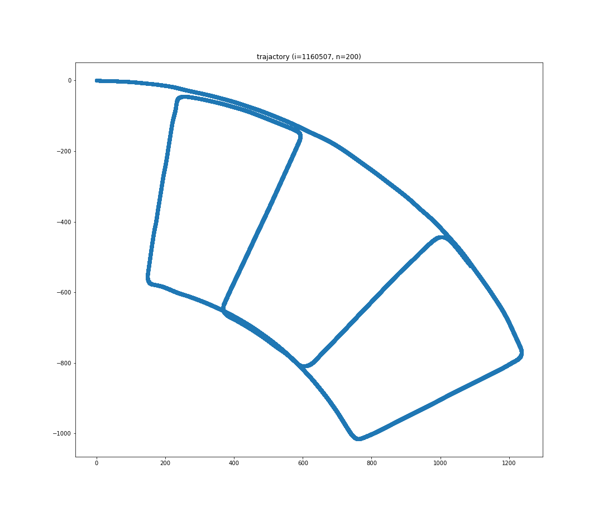
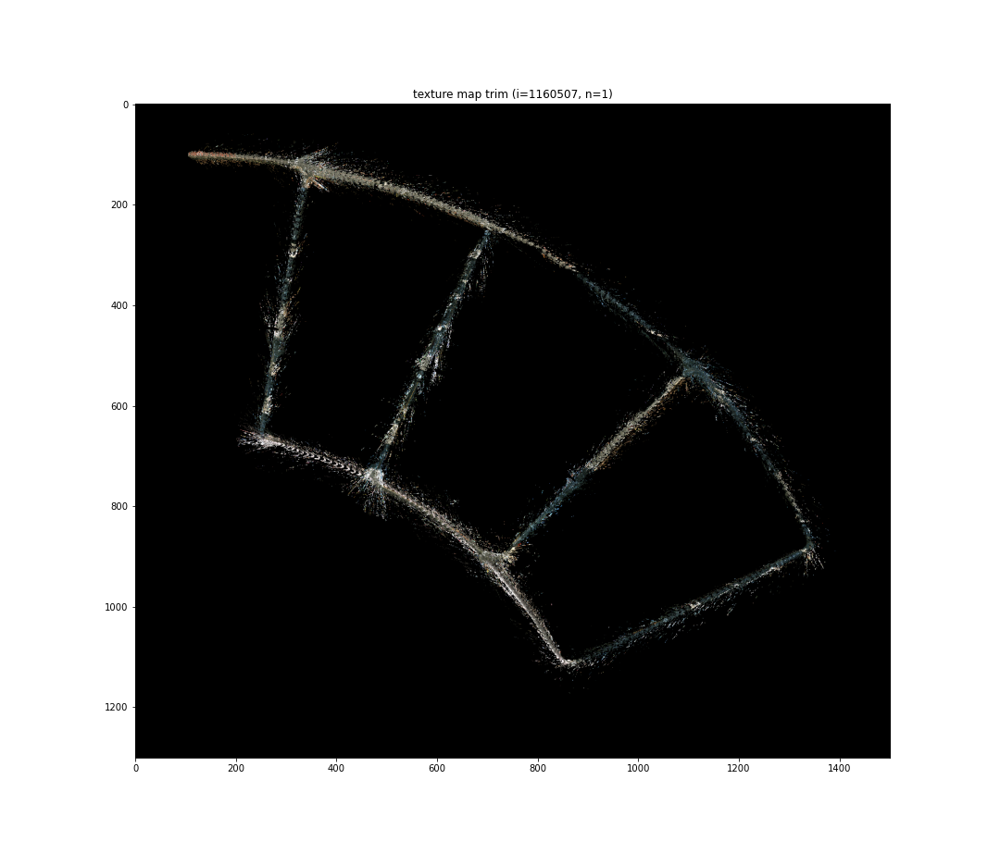

# Particle Filter SLAM and Texture Mapping
This is the project 2 of the course UCSD ECE276A: Sensing & Estimation in Robotics.

Simultaneous localization and mapping (SLAM) is an important topic in robotics. It tries to utilize sensor data and user input to estimate the agent’s state and update a map of the surrounding environment at the same time. With the improvements in computing speed on end-devices and the availability of low-cost sensors, its algorithms are now widely used in robot navigation, robot mapping, and autonomous vehicles.

In this project, we propose a solution for SLAM using particle filter. Besides, we build a texture map by projecting RBG color in the stereo image pairs onto the map. The solution is then evaluated using data collected by an autonomous car.

## Screenshots

Grid Map | Trajactory | Texture Map
--------------------|---------------------|--------------------
||

## References
* [UCSD ECE276A: Sensing & Estimation in Robotics](https://natanaso.github.io/ece276a/)